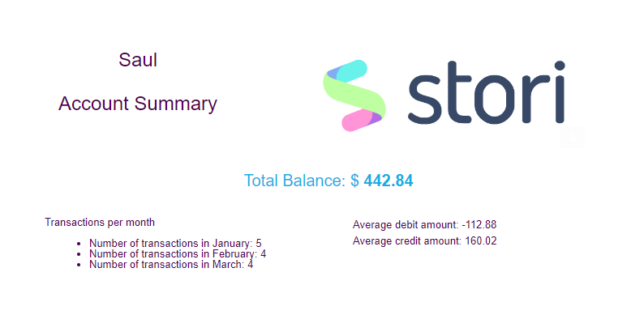
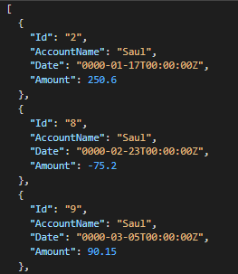

# Transaction-summary-email
This project processes a CSV file containing account transactions and sends a summary email to the user. The CSV file is read from an AWS S3 bucket. The application is designed to run on AWS Lambda.

**Table of Contents**
- [Prerequisites](#prerequisites)
- [CVS File Format](#csv-file-format)
- [Setup](#setup)
- [Usage](#usage)

## Prerequisites

- [Go](https://golang.org/doc/install) installed
- [Docker](https://docs.docker.com/engine/install/ubuntu/) installed
- [AWS CLI](https://aws.amazon.com/cli/) installed and configured with AWS credentials
- [SAM CLI](https://docs.aws.amazon.com/serverless-application-model/latest/developerguide/serverless-sam-cli-install.html) installed

## CSV File Format

The CSV file should have the following format:
```csv
Id,Date,Transaction  
0,7/15,+60.5  
1,7/28,-10.3  
2,8/2,-20.46  
3,8/13,+10  
```

Where:
- Id is a unique identifier for the transaction
- Date is the transaction date in the format M/D
- Transaction is the transaction amount, with a '+' sign for credit transactions and a '-' sign for debit transactions

## Setup

1. Clone the repository:
```bash
git clone https://github.com/saultorres-imt/transaction-summary-email.git
cd transaction-summary-email
```

2. Give permision to script
```bash
chmod +x deploy.sh
```

3. Run the script
```bash
./deploy.sh
```
This script will configure all parameter needed, upload the file located in mock-data/txns2.csv and build and deploy the application with sam. It will output the value of the S3bucket so you can upload another file txns.csv and the endpoint for you to test the API.

4. Verify email addresses
Run the following command to verify the email addresses that will be used
```bash
aws ses verify-email-identity --email-address youremail@example.com
```

## Usage

This section describes how to test the API endpoint using the POST method with a JSON body. You can use tools like curl, Postman, or other HTTP clients to test the endpoint.

- JSON Body
```json
{
    "name":"Account owner",
    "from":"emailVerified@outlook.com",
    "to":"emailVerified2@gmail.com"
}
```

### Curl
```bash
curl -X POST -H "Content-Type: application/json" -d '{"name": "Account owner", "from":"emailVerified@outlook.com", "to":"emailVerified2@gmail.com"}' https://example.com/api/your-endpoint
```
Check the response from the server. If the request was successful, you should see the "Email Sent" message.

To test the Get method, the curl does not need a json body.
```bash
curl -X GET 'https://example.com/api/your-endpoint' --header 'Accept: */*'
```


### HTTP Clients

1. Create a new request.
2. Set the request method to POST.
3. Replace <API_URL> with your API endpoint URL in the address bar.
4. Select the Body tab, choose raw, and set the content type to JSON.
5. Replace <JSON_BODY> with the JSON body you want to send in the request.
6. Click the Send button to send the request.

Then you would receive an email like this:


Same steps for the Get request but without a Json Body and change request method to Get. Then you shoul get a response like this:  


